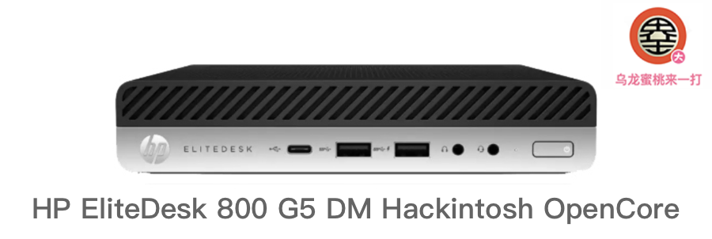

## HP EliteDesk 800 G5 DM Hackintosh OpenCore EFI



### [简体中文](https://github.com/hackintosh-club/HP-EliteDesk-800-G5-DM-OpenCore)

### OpenCore

[OpenCore 0.9.7](https://github.com/acidanthera/OpenCorePkg)

### OS Version Tested

- macOS Monterey 12.x
- macOS Ventura  13.x 
- macOS Sonoma  14.x 

### Hardware

- Motherboard: Q370
- CPU: Intel 9th i9-9900T ES
- RAM: GLOWAY 16G*2 DDR4 2666 MHz
- SSD: Fanxiang S500PRO 2TB MacOS Ventura
- iGPU: Intel UHD Graphic 630
- Audio: Conexant Cx20632
- Ethernet Card:  Intel L219-LM
- WiFi: Intel AX200
- PSU: PA-1900-08H2 90W 19V 4.74A

### Notes

 - Use [OpenCore Configurator](https://mackie100projects.altervista.org/opencore-configurator/) or [OCAuxiliaryTools](https://github.com/ic005k/OCAuxiliaryTools) build your SMBIOS
 - The AirportItlwm.kext driver in this EFI is only compatible with the MacOS 13 Ventura version
 - To install macOS 14 Sonoma, Please replace the AirportItlwm.kext driver that is suitable for version 14 on your own

### Bios Setup

```
Security > BIOS SureStart > Unchecked ALL
Security > SIntel Software Guard Extensions (SGX) Disable
Secure Boot Configuration > Configure Legacy Support and Secure Boot Legacy Support Disable and Secure Boot Disable
System Options > Configure Storage Controller for RAID Unchecked
System Options > VTd Unchecked
Built-In Device Options > Video memory size 64 MB
Built-In Device Options > Wake on Lan Disable
```

### Contact Us

QQ Group: 23304408


### Tools

- [Hackintool](https://github.com/headkaze/Hackintool) 
- [OCAuxiliaryTools](https://github.com/ic005k/OCAuxiliaryTools) AKA `OCAT`.
- [OpenCore Configurator](https://mackie100projects.altervista.org/opencore-configurator/) AKA `OCC`.
- [gibMacOS](https://github.com/corpnewt/gibMacOS) Build your own MacOS image.
- [ProperTree](https://github.com/corpnewt/ProperTree) Plist editor.
