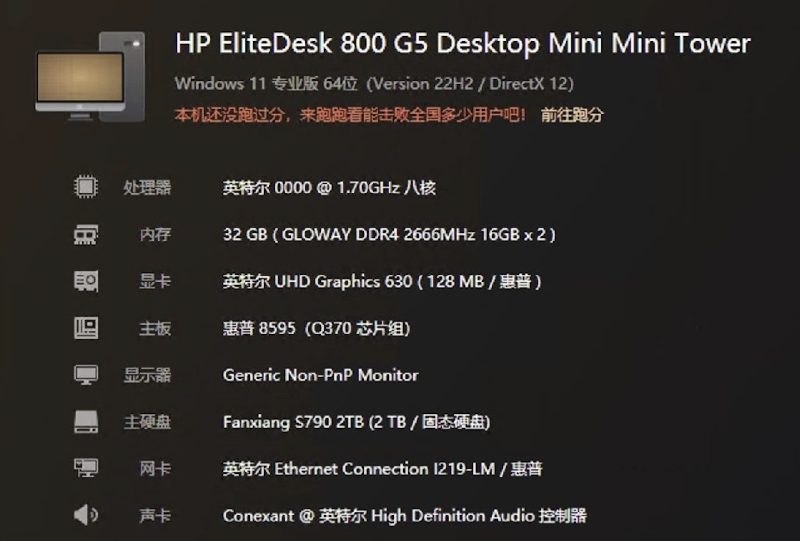

## 惠普 EliteDesk 800 G5 DM 黑苹果 OpenCore EFI


### [ENGLISH](README.EN.md)

### OpenCore

[OpenCore 0.9.5](https://github.com/acidanthera/OpenCorePkg)

### macOS

- macOS Monterey 12.x
- macOS Ventura   13.x 
- macOS Sonoma  14.x 

### 硬件

- 芯片组: Q370
- 处理器: 英特尔9代 i9-9900T ES
- 内存: 光威 16GB*2 DDR4 2666 MHz
- 硬   盘: 梵想 S500PRO 2TB MacOS Ventura
- 核   显: 英特尔超核心显卡630
- 声卡: 科胜讯 Cx20632
- 有线网卡: 英特尔 L219-LM
- 无线网卡: 英特尔 AX200
- 电   源: PA-1900-08H2 90W 19V 4.74A

### BIOS设置

```
安全
  |-- BIOS Sure Start
     |-- 每一次引导均验证引导块：关闭
  |-- Intel 软件防护扩展指含（SGX）：禁用
  
先进  
  |-- 启动选项
     |-- 快速引导：关闭
	   |-- 网络（PXE）引导：关闭
	|-- 安全引导配置
     |-- 配置传统支持和安全引导：禁用传统支持和禁用安全引导
	|-- 系统选项
	   |-- 配置 RAID 存储控制器：关闭
	   |-- 定向I/O虚拟化技术（VTd）：关闭
	|-- 内置设备选项
     |-- 通过 LAN 唤醒：禁用
     |-- 显存大小:64 MB
  |-- 电源管理选项
     |--S5 最大节能：关闭
     |--从键盘端口启动：关闭
     |--唯一睡眠状态闪烁速率：关闭

```

### 注意事项

 - 安装成功后必须使用 [OpenCore Configurator](https://mackie100projects.altervista.org/opencore-configurator/) 或者 [OCAuxiliaryTools](https://github.com/ic005k/OCAuxiliaryTools) 生成你自己的 SMBIOS
 - 此EFI中的AirportItlwm.kext驱动仅适配MacOS 13 Ventura版本
 - 安装macOS 14 Sonoma请自行替换适合14版本的AirportItlwm.kext驱动


### 联系我们

QQ群: 23304408


### 鲁大师硬件截图



### 常用工具

- [Hackintool](https://github.com/headkaze/Hackintool) 
- [OCAuxiliaryTools](https://github.com/ic005k/OCAuxiliaryTools) AKA `OCAT`.
- [OpenCore Configurator](https://mackie100projects.altervista.org/opencore-configurator/) AKA `OCC`.
- [gibMacOS](https://github.com/corpnewt/gibMacOS) Build your own MacOS image.
- [ProperTree](https://github.com/corpnewt/ProperTree) Plist editor.